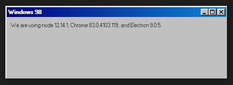

# Electron Windows 98

An electron app using [98.css](https://github.com/jdan/98.css)



## Requirements

* [Node.js >= 10](https://nodejs.org)
* [npm >= 6](https://www.npmjs.com)

## Run

```shell
git clone https://github.com/LuisEnMarroquin/electron-windows-98.git
cd electron-windows-98/
npm install
npm start
```

## Build

Inside the [package.json](package.json) on the **scripts** section you'll find scripts for building on most platforms
